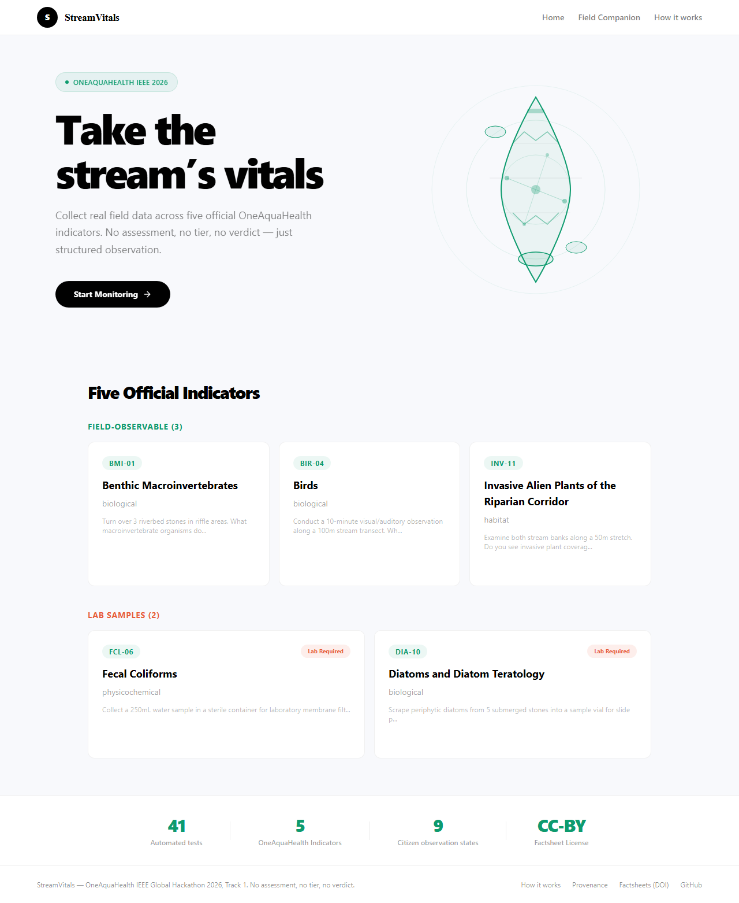
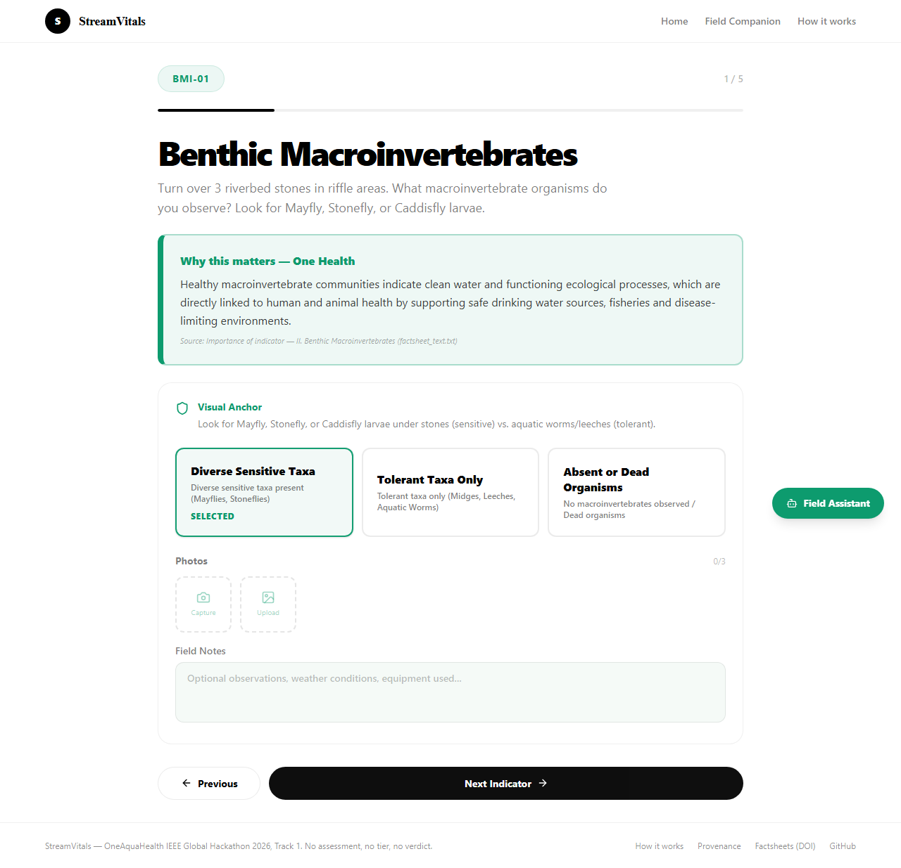
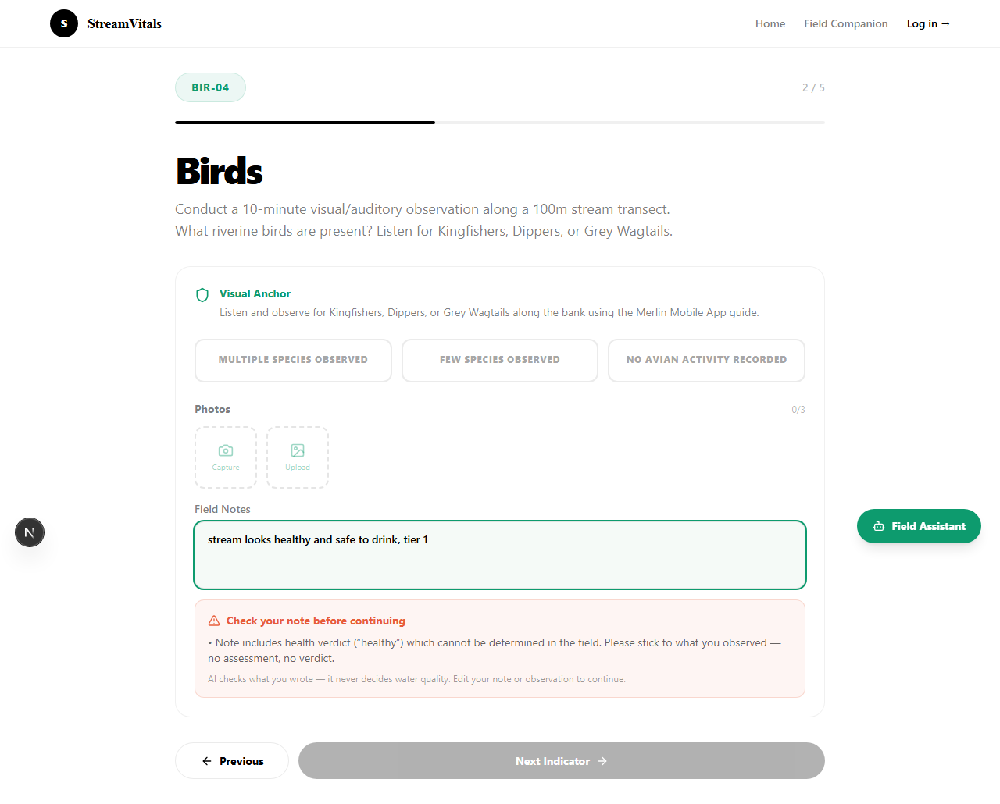
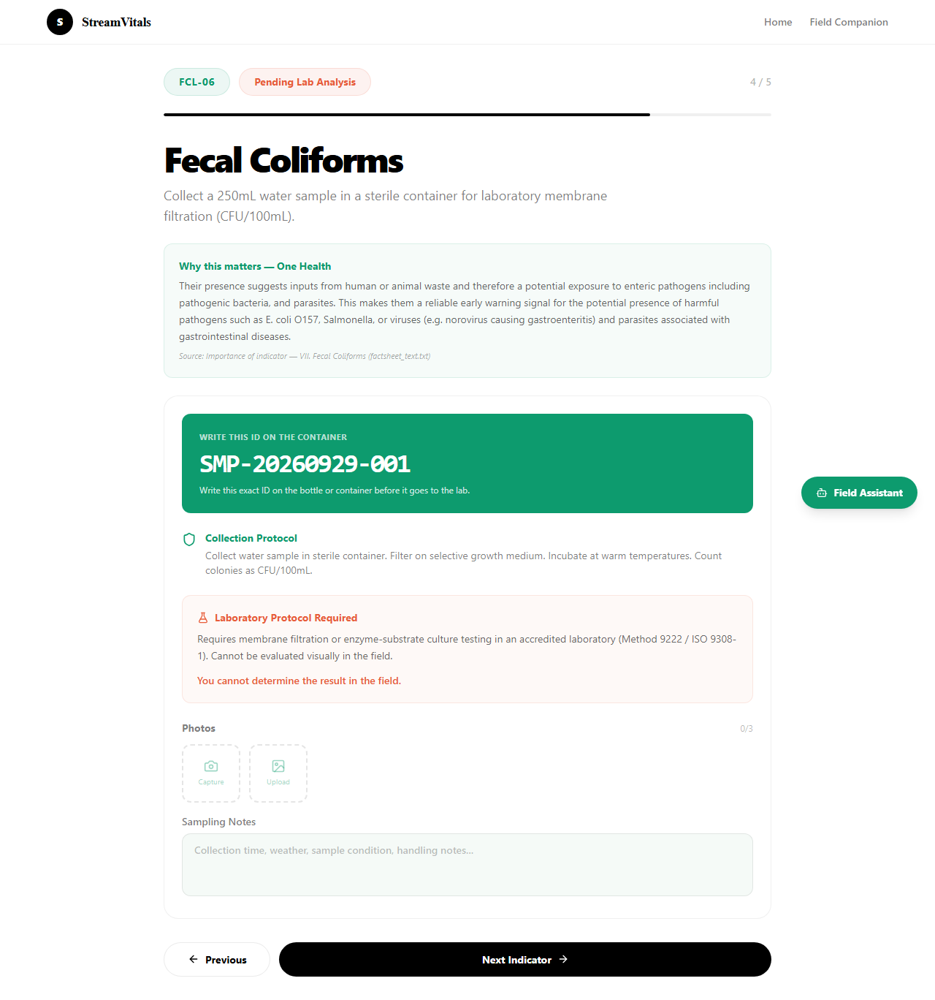
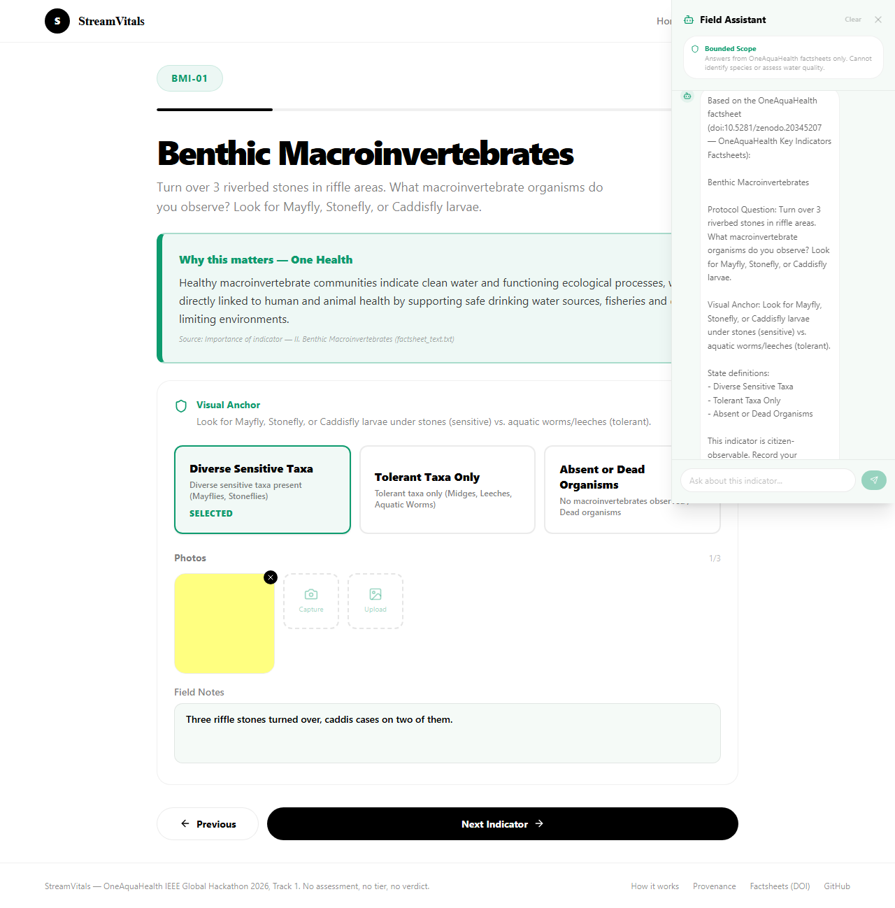
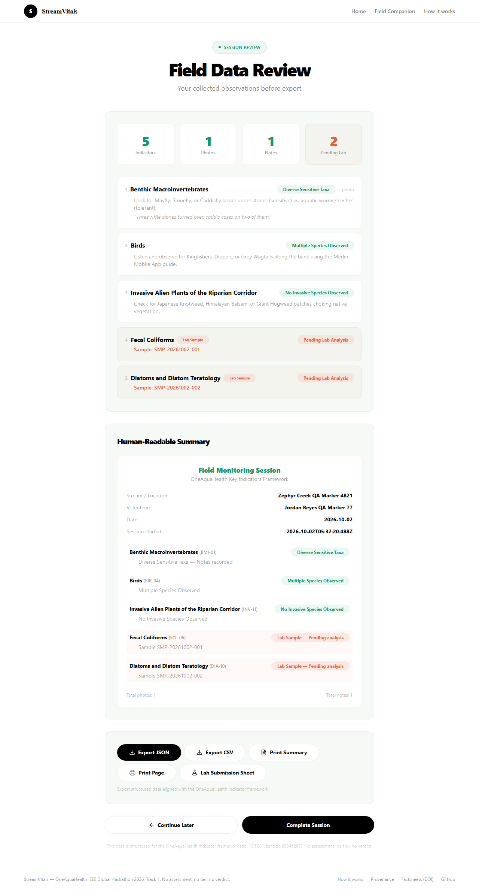
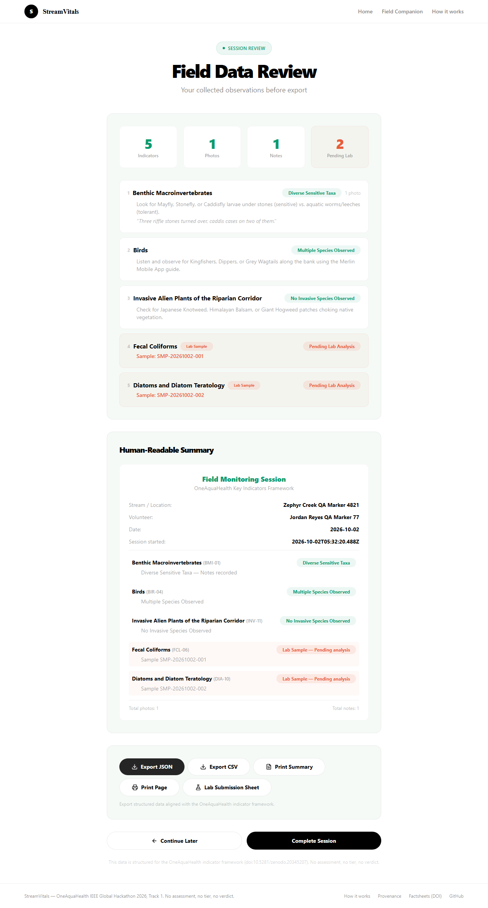
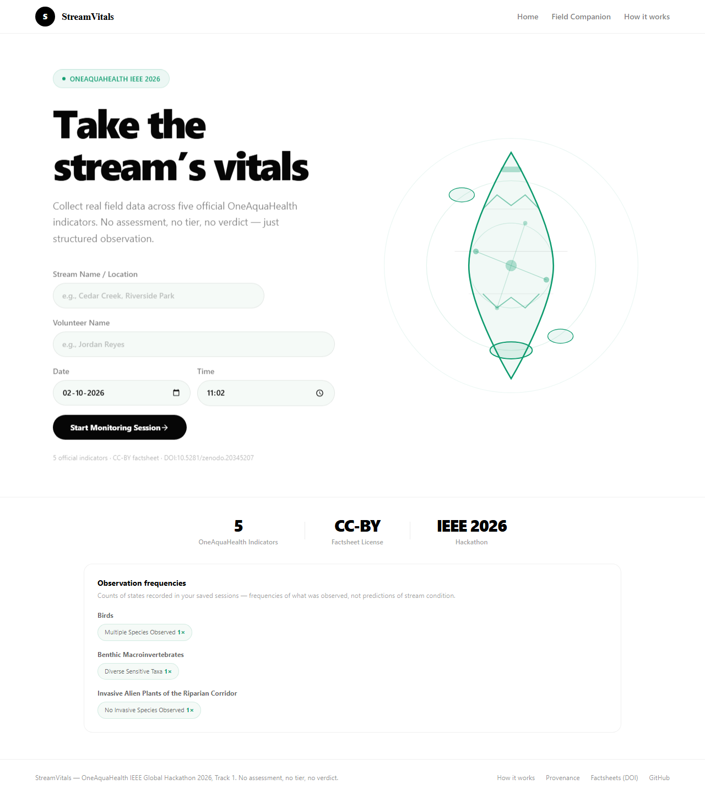
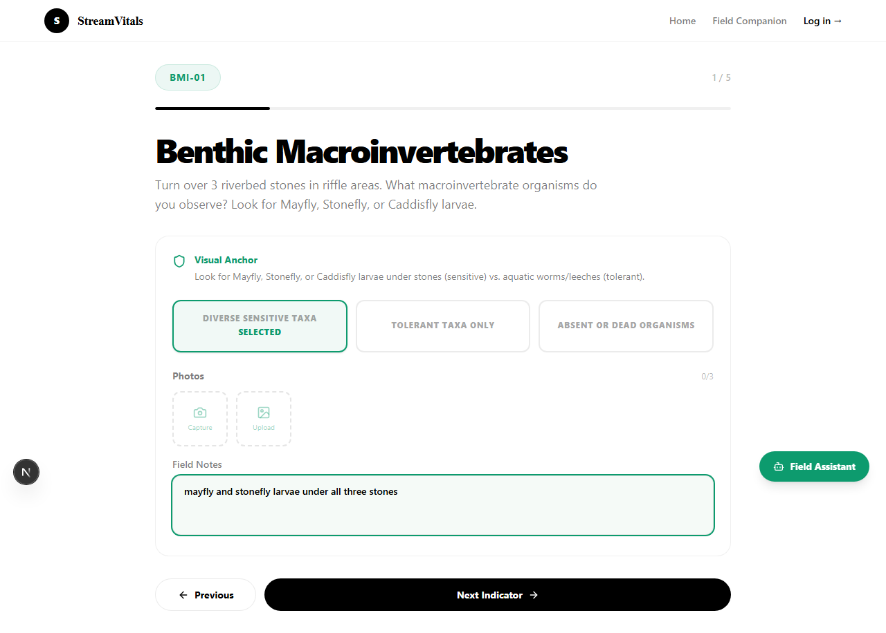
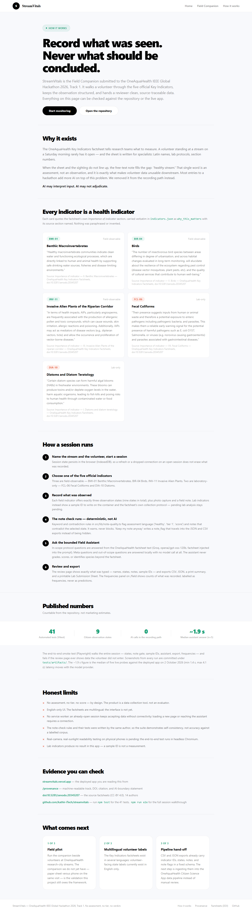

# StreamVitals

StreamVitals — OneAquaHealth IEEE Global Hackathon 2026, **Track 1** (guided workflows, simplified terminology, data-accuracy features)

**We don't use AI to decide whether the stream is healthy; we use AI to make sure the thing being assessed is actually what the citizen observed.**

## Track

This submission enters **Track 1** only. We are not claiming Track 3, because the app contains no AI-supported assessment: nothing in the product grades, scores, tiers, or adjudicates an observation. The only AI component is a bounded Q&A panel that quotes the official factsheets.

## What It Does

A citizen answers guided questions about an urban stream across five official OneAquaHealth indicators — Benthic Macroinvertebrates (BMI-01), Birds (BIR-04), Invasive Alien Plants (INV-11), Fecal Coliforms (FCL-06), and Diatoms (DIA-10). FCL-06 and DIA-10 are laboratory-only and cannot be evaluated in the field. For those two, the app shows a prominent **sample ID** to write on the container, a single collection protocol, photo capture, and sampling notes.

The citizen selects observation states, optionally captures photos, and adds field notes. All data is stored persistently in IndexedDB and exported via CSV, JSON, or a printable **Lab Submission Sheet**.

Offline boundary: data entry keeps working without connectivity on an already-open session, but loading a new page and reaching the AI assistant both require a connection. There is no service worker, so this is a documented fallback, not offline-first.

A bounded **AI Field Assistant** answers questions using only the OneAquaHealth Key Indicators factsheets (doi:10.5281/zenodo.20345207). It never identifies species beyond what's in the factsheet, never gives opinions on water quality or health, and never assigns tiers, scores, or severity levels.

**AI may interpret input. AI may not adjudicate.**

## The Note Check Is Rule-Based, Not AI

`src/lib/note-quality.ts` is a **deterministic keyword and contradiction rule set**. It contains no model, no API call, and no inference. It does two things:

1. **Unsupported wording** — flags assessment-style words ("healthy", "tier 1", "score", "contaminated") that the framework cannot record.
2. **Contradiction** — flags notes that describe the opposite of the selected observation state.

It **warns; it does not block.** The volunteer can keep the note with an explicit "Keep my note anyway" click. When they do, a `note_flag` field is written to the session and appears in the JSON and CSV export, so the flag travels with the data instead of being hidden.

A negation guard was added after testing: a bare taxon name under a negation ("did not see knotweed or balsam") agrees with the selected state and is no longer flagged.

Honest limitation: these rules and their tests were written by the same agent, so the test suite demonstrates **self-consistency, not accuracy**. The 12 realistic notes in `note-quality.test.ts` (6 that must not flag, 6 that must) exist to probe false positives, not to prove precision against a labelled corpus.

## One Health Link

Each indicator page carries a "Why this matters" line quoting the factsheet's own *Importance of indicator* section, with the section named in `why_this_matters_source`. All five indicators have a verified quote; nothing was paraphrased or invented.


## How It's Built

- **Frontend**: Next.js 16 (App Router), TypeScript (strict), Tailwind CSS 4
- **AI Layer**: Groq (`openai/gpt-oss-120b`) — bounded assistant only, never adjudication
- **Persistence**: IndexedDB in the browser, session state in sessionStorage
- **Styling**: Light theme only (#f8f9fc background, #0d9b6e accent, #ffffff cards)
- **Testing**: Vitest with jsdom environment (IndexedDB provided by `fake-indexeddb`)
- **Deployment**: Vercel

### Project structure

```
app/                 <- the ONLY Next.js app directory (routes, layout, global CSS)
src/components/      <- shared React components
src/data/            <- indicator definitions and factsheet content
src/lib/             <- session storage, note-quality rules, factsheet lookup
tests/               <- Playwright smoke test + screenshot artifacts
research/            <- source factsheet text used for provenance checks
```

There is intentionally no `src/app/`. A previous revision carried a duplicate
`src/app/` tree alongside `app/`. Next.js silently prefers the root `app/`, so
every edit made to `src/app/` had no effect on the running app while still
appearing to succeed. The dead tree has been deleted; `app/` is the single
source of truth. Do not reintroduce `src/app/`.

## Pages

1. **`/`** — Home page with 5 indicator cards, each navigates to `/field/[indicator]`
2. **`/about`** — How it works: why the product exists, the One Health quote for each indicator, the session pipeline, the published numbers, honest limits, and the roadmap
3. **`/field`** — Session dashboard. Captures stream name, **volunteer name**, date and time, then creates or continues a monitoring session
4. **`/field/[indicator]`** — Per-indicator observation form. Citizen indicators get state selection, photo capture, and field notes. Lab indicators (FCL-06, DIA-10) get a prominent sample ID to write on the container, one collection protocol, photo capture, and sampling notes.
5. **`/field/review`** — Review all observations, print a Lab Submission Sheet, export (JSON/CSV/Print), submit session

The footer links to **`/provenance`** (machine-readable track, DOI, citation, and AI-boundary statement).

## Constraints

- No tier ratings (T1/T2/T3) anywhere in the UI
- No diagnostic assessments
- Lab-only isolation for FCL-06/DIA-10 indicators
- Indicator-to-indicator navigation uses the Next.js client router (`router.push`) — no full page reload, so assistant and form state survive Next/Previous. Recovery redirects (missing session) still use full page loads.
- Navigation links use Next.js `<Link>` (client-side). No React Router anywhere.
- Case-insensitive indicator lookup
- Light theme only — no theme toggles, no dark mode

## How to Run Locally

```bash
# Install dependencies
npm install

# Run development server
npm run dev

# Run tests
npm test

# Build for production
npm run build
```

## Data Sources

- **OneAquaHealth Key Indicators Factsheets**: Zenodo doi:10.5281/zenodo.20345207 (CC-BY 4.0)

## Architecture

1. **Home**: Indicator selection with status (available/limited)
2. **Session**: Create or continue a monitoring session
3. **Field**: Per-indicator observation with state selection and optional photo capture
4. **Review**: Summary of all observations with export and submit
5. **AI Assistant**: Bounded factsheet-based Q&A sidebar
6. **API**: Groq proxy for the bounded assistant, provenance metadata

## API Routes

- `POST /api/ai/assistant` — AI assistant (Groq proxy with offline fallback)
- `GET /api/provenance` — Data provenance metadata
- `GET /provenance` — the same provenance statement as a page-level JSON response

Exports (CSV / JSON / printable summary / Lab Submission Sheet) are generated in the browser from IndexedDB and downloaded directly; there is no server-side export endpoint.

## Published Numbers

Countable from this repository, not estimates:

| Number | What it is |
|---|---|
| **41** | Vitest tests across 4 files (session 7, factsheet/assistant 14, note rules 15, frequencies 5) |
| **9** | Citizen observation states — 3 field indicators × 3 states each |
| **0** | AI calls in the recording path (state selection, note gate, exports are deterministic) |
| **~1.9 s** | Median assistant answer, 5 live probes against the deployed app on 2026-10-02 (min 1.4 s, max 4.1 s; moves with the provider) |
| **21** | Committed screenshots from automated runs under `tests/artifacts/` |

## Screenshots

Captured by the automated smoke test (`npm run e2e`), committed under [`tests/artifacts/`](tests/artifacts/):

| | | |
|---|---|---|
|  |  |  |
|  |  |  |
|  |  |  |
|  | | |

## Submission Artifacts

- [`DEVPOST.md`](DEVPOST.md) — the paste-ready Devpost write-up: problem, five features, the number (41 tests), before/after, removed features, limits, roadmap.
- [`VIDEO.md`](VIDEO.md) — the shot-by-shot demo script (~4:15, inside the event's 3–5 minute requirement) with a recording checklist.

## What's Next

1. **Field pilot** — run the companion beside volunteers at OneAquaHealth research-city streams; the comparison we do not yet have is paper sheet versus phone on the same visit.
2. **Multilingual volunteer labels** — the factsheets are multilingual; the UI currently is not.
3. **Pipeline hand-off** — CSV/JSON exports already carry indicator IDs, states, notes, and note flags in a fixed schema; the next step is ingesting them into the OneAquaHealth Citizen Science App pipeline.

## Testing

- `src/lib/field-session.test.ts` — 7 tests for IndexedDB session management
- `src/lib/factsheet-content.test.ts` — 14 tests for factsheet lookup, out-of-scope detection, and the offline assistant pipeline (in-scope / nonsense / meta questions get three distinct responses)
- `src/lib/note-quality.test.ts` — 15 tests, including 12 realistic notes (6 must not flag, 6 must)
- `src/lib/observation-frequencies.test.ts` — 5 tests for the observation-frequencies counts (41 tests total)

Run with `npm test` (Vitest, jsdom environment, IndexedDB via `fake-indexeddb`).

The end-to-end smoke test (`npm run e2e`) asserts that the stream name, **volunteer name**, date, selected states, notes, sample IDs, and **photo count shown on the review page match what was actually typed and uploaded**. It also asserts the page contains no "Not provided" placeholder, that the assistant's in-scope, nonsense, and meta questions receive three distinct correct responses, and that the observation-frequencies panel on `/field` shows real counts labeled as frequencies rather than predictions. This exists because an earlier version of the review page rendered a hardcoded placeholder session, and the previous test suite passed against it. It also exists because `/field` once had no volunteer input at all, so the review page legitimately (but uselessly) showed "Not provided" for every session. If the review page ever shows data the user did not enter, the smoke test now fails.

## Factsheet Provenance

Collection instructions shown to volunteers were checked line by line against `research/factsheet_text.txt`. Four instructions that could not be traced to the factsheet were removed rather than left in place:

| Instruction | In factsheet? | Action |
|---|---|---|
| Store at 4 °C | No — only −80 °C appears (Diptera, page 12) | Removed |
| Lugol's iodine preservative | No | Removed |
| Toothbrush for scraping diatoms | No | Removed |
| 10 cm / 10 cm² sample depth or area | No | Removed |

The replacement `visual_anchor_guide` text for FCL-06 and DIA-10 is drawn from the factsheet's own *How is the indicator measured?* sections. No volunteer is asked to follow a step that the source document does not state.

