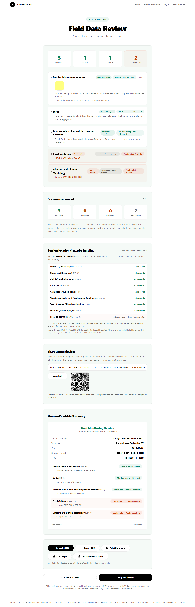
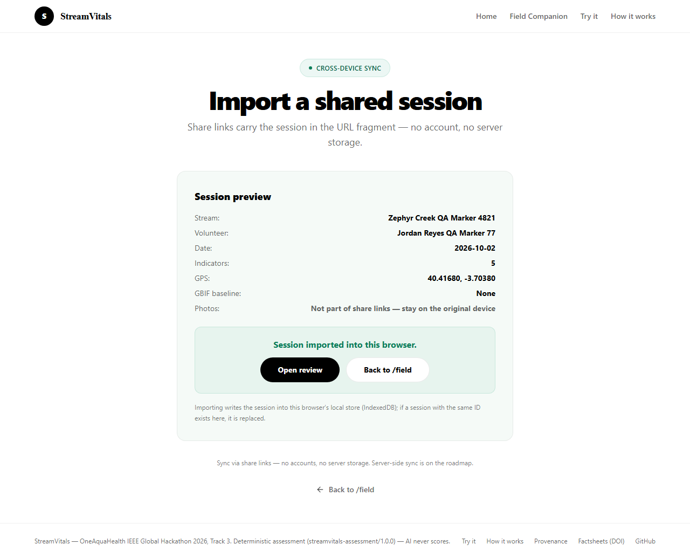

# StreamVitals

[](https://github.com/kathir-iTech/streamvitals/actions/workflows/ci.yml)

StreamVitals — OneAquaHealth IEEE Global Hackathon 2026, **Track 3** (AI-Supported Assessment — by deterministic rules, not a model)

**We don't use AI to decide whether the stream is healthy; we use AI to make sure the thing being assessed is actually what the citizen observed.**

## Track

This submission enters **Track 3**. The AI-supported assessment claim is precise: the app's only AI component is a bounded Q&A panel that quotes the official factsheets — and the assessment itself is produced by a pure TypeScript module (`src/lib/assessment/engine.ts`, version `streamvitals-assessment/1.0.0`) that maps observed states to bands (favorable / moderate / degraded, or pending for lab indicators) and attaches the chain of evidence behind every band. The engine never imports a model, never calls the network, never reads the clock — its test suite reads the module's own source and fails if it ever does.

**Deterministic rules assess. AI may explain — AI never scores.**

## What It Does

A citizen answers guided questions about an urban stream across five official OneAquaHealth indicators — Benthic Macroinvertebrates (BMI-01), Birds (BIR-04), Invasive Alien Plants (INV-11), Fecal Coliforms (FCL-06), and Diatoms (DIA-10). FCL-06 and DIA-10 are laboratory-only and cannot be evaluated in the field. For those two, the app shows a prominent **sample ID** to write on the container, a single collection protocol, photo capture, and sampling notes.

The citizen selects observation states, optionally captures photos, and adds field notes. Once a state is selected (or a lab sample ID exists), the deterministic assessment card renders: band label, the rule that fired, the factsheet passage behind it, and the honesty caveats. All data is stored persistently in IndexedDB and exported via CSV, JSON, or a printable **Lab Submission Sheet** — every export carries the band, the engine version, and the chain rule IDs.

Offline boundary: a small service worker (network-first) caches pages you have already visited, so they reload without connectivity and never-visited pages get a designed offline screen; data entry keeps working without connectivity on an already-open session. The AI assistant and a first visit to any page still require a connection — the offline reload is asserted in the e2e suite, but this is not offline-first (no background sync, no precached app shell).

A bounded **AI Field Assistant** answers questions using only the OneAquaHealth Key Indicators factsheets (doi:10.5281/zenodo.20345207). It never identifies species beyond what's in the factsheet, never gives opinions on water quality or health, and never assigns tiers, scores, or severity levels — for health judgements it points back at the deterministic assessment card on the page.

**Deterministic rules assess. AI may explain — AI never scores.**

## The Assessment Is Rule-Based, Not AI

`src/lib/assessment/engine.ts` (`streamvitals-assessment/1.0.0`) is the Track 3 core: a pure function from (indicator, observed state) to a band with a chain of evidence.

- **Bands**: `favorable` / `moderate` / `degraded` for citizen indicators; `pending_lab` for FCL-06 and DIA-10 (a sample ID is not a measurement — the rules refuse to grade what was not measured); `unassessable` when a state or rule is missing, with the gap stated instead of hidden.
- **Chains**: every band carries structured steps — the observation, the rule that fired (`rule/{indicator}/{state}`), and the factsheet sources (`source/factsheet/{indicator}`) — rendered as a readable `<ol>` on the indicator card and exported with the data.
- **Grounding**: bands cite the factsheet's own measurement principles (tolerance-based scoring for BMI, species richness for BIR, % coverage for INV) and are explicitly labelled **proxies, never laboratory indices** — BMWP/IBD/IPS require taxon-level lab identification (factsheet §§I, II).
- **Honesty**: each result carries caveats (e.g. a BMWP score would quantify the degradation; it cannot be computed from a photograph) and a `scoredBy: "No AI, no network, no hidden state"` statement.
- **Session view**: `/field/review` summarises all five indicators (`assessment-summary`) with per-indicator chips and worst-band across assessed indicators, and shows every uploaded photo as a clickable thumbnail that opens full-size in a lightbox; every export (JSON/CSV/print/lab sheet) carries the band, engine version, and rule IDs.
- **Source guard**: `engine.test.ts` reads the module's own source and fails if it ever imports a model, calls the network, reads the clock, or uses randomness.

## Location & GBIF Baseline

The session form offers an optional **"Use my location (GPS)"** capture (browser Geolocation API). The coordinates live in the session record (`location: {lat, lng, accuracyM, capturedAt}`) — stored in IndexedDB on the device, included in exports, and **never sent to any server of ours** (there is no server endpoint that receives them).

When the review page opens with a location present, it fetches a **GBIF baseline** directly from the browser against `api.gbif.org/v1` (CORS-open, no API key, no proxy): for each of 8 configured taxa — EPT orders for BMI-01, Aves for BIR-04, the factsheet's three abbreviated IAP examples expanded to full binomials for INV-11, Bacillariophyta for DIA-10 — it resolves the GBIF taxon via `species/match`, then counts occurrences with `occurrence/search?geo=…&radius=50000&limit=0`. FCL-06 is shown as "no taxon group — laboratory indicator". The result is stored with the session (`gbifBaseline`, timestamped `capturedAt`) so it is fetched once, exported with the data, and honestly labelled:

> GBIF.org occurrence records near the session location — presence data for context only, not a water-quality assessment. Absence of records is not absence of species.

Exports: JSON carries `session.location` and `session.gbifBaseline`; CSV carries `session_latitude`, `session_longitude`, `location_accuracy_m` columns. The GBIF client lives in `src/lib/gbif.ts` with an injectable fetcher and 6 tests covering URL shape, no-match, and network-failure behaviour.

## Multi-Device Sync (Share Links)

Sessions move between devices with **no accounts and no server storage**: the review page's "Create share link" builds a versioned, deflate-compressed base64url payload of the session (states, notes, flags, sample IDs, GPS, GBIF baseline) and puts it in the **URL fragment** of `/sync#…` — fragments are never sent to any server. The page also renders a QR code (zero-dependency `qrcode-generator`) so a phone can open the link by camera; compression is what keeps a full real session (5 detailed notes + GPS + 8-taxon GBIF baseline) inside the 2953-byte QR budget, and payloads that still exceed it fall back to copy/paste honestly. Links created before compression (plain base64url JSON) still decode.

`/sync` decodes, validates (version + required fields — garbage, truncation, and wrong versions are rejected), previews the session, and imports it into the local IndexedDB store (same session ID replaces the existing record). Deliberately excluded and stated in the UI: **photos stay on the device that captured them**; static lab protocol text and GBIF attribution/labels are re-derived from source constants on import, not carried in the link. `src/lib/session-share.ts` holds encode/decode with 9 tests, including a QR-budget guard test so payload bloat fails the suite and a fit test for the owner's full Phase E session.

Server-side sync (a real datastore) is **not** claimed: the deployed project has no storage backend provisioned, and the roadmap says so instead of faking it.

## The Note Check Is Rule-Based, Not AI

`src/lib/note-quality.ts` is a **deterministic keyword and contradiction rule set**. It contains no model, no API call, and no inference. It does two things:

1. **Unsupported wording** — flags assessment-style words ("healthy", "tier 1", "score", "contaminated") that the framework cannot record.
2. **Contradiction** — flags notes that describe the opposite of the selected observation state.

It **warns; it does not block.** The volunteer can keep the note with an explicit "Keep my note anyway" click. When they do, a `note_flag` field is written to the session and appears in the JSON and CSV export, so the flag travels with the data instead of being hidden.

A negation guard was added after testing: a bare taxon name under a negation ("did not see knotweed or balsam") agrees with the selected state and is no longer flagged.

Honest limitation: these rules and their tests were written by the same agent, so the test suite demonstrates **self-consistency, not accuracy**. The 12 realistic notes in `note-quality.test.ts` (6 that must not flag, 6 that must) exist to probe false positives, not to prove precision against a labelled corpus.

## One Health Link

Each indicator page carries a "Why this matters" line quoting the factsheet's own *Importance of indicator* section, with the section named in `why_this_matters_source`. All five indicators have a verified quote; nothing was paraphrased or invented.


## How It's Built

- **Frontend**: Next.js 16 (App Router), TypeScript (strict), Tailwind CSS 4
- **AI Layer**: Groq (`openai/gpt-oss-120b`) — bounded assistant only, never adjudication
- **Persistence**: IndexedDB in the browser, session state in sessionStorage
- **Observability**: anonymous client errors and LCP/CLS are POSTed to `POST /api/client-errors` (zod-validated, per-IP rate-limited, one JSON line in Vercel's function logs) — no cookies, no third-party analytics; a root error boundary reports and offers retry/reload
- **Styling**: Light theme only (#f8f9fc background, #0d9b6e accent, #ffffff cards)
- **Testing**: Vitest with jsdom environment (IndexedDB provided by `fake-indexeddb`)
- **Deployment**: Vercel

### Project structure

```
app/                 <- the ONLY Next.js app directory (routes, layout, global CSS)
src/components/      <- shared React components
src/data/            <- indicator definitions and factsheet content
src/lib/         <- session storage, note-quality rules, factsheet lookup, deterministic assessment engine
tests/               <- Playwright specs (smoke, a11y, offline) + screenshot artifacts
research/            <- source factsheet text used for provenance checks
```

There is intentionally no `src/app/`. A previous revision carried a duplicate
`src/app/` tree alongside `app/`. Next.js silently prefers the root `app/`, so
every edit made to `src/app/` had no effect on the running app while still
appearing to succeed. The dead tree has been deleted; `app/` is the single
source of truth. Do not reintroduce `src/app/`.

## Pages

1. **`/`** — Home page with 5 indicator cards, each navigates to `/field/[indicator]`
2. **`/about`** — How it works: why the product exists, the One Health quote for each indicator, the session pipeline, the published numbers, honest limits, and the roadmap
3. **`/field`** — Session dashboard. Captures stream name, **volunteer name**, date and time (plus optional GPS location), then creates or continues a monitoring session
4. **`/field/[indicator]`** — Per-indicator observation form. Citizen indicators get state selection, photo capture, and field notes. Lab indicators (FCL-06, DIA-10) get a prominent sample ID to write on the container, one collection protocol, photo capture, and sampling notes.
5. **`/field/review`** — Review all observations (including viewable photo thumbnails), session assessment grid, GBIF baseline, share-across-devices link, print a Lab Submission Sheet, export (JSON/CSV/Print), submit session
6. **`/sync`** — Import a shared session from a `/sync#…` link (QR or paste); validates and previews before writing to this browser
7. **`/try`** — Five-minute walkthrough for testers: step list, QR to the app, the promises (device-local data, fragment-only share links, rate-limited assistant, error-only telemetry), and a button that opens a clearly-labeled **synthetic sample session** — bannered as non-field data on review, excluded from observation frequencies, and loaded via `?session=` so it never hijacks an in-progress session pointer

The footer links to **`/provenance`** (machine-readable track, DOI, citation, and AI-boundary statement).

## Constraints

- Citizen bands are labelled **proxies, never laboratory indices** — no BMWP/IBD/IPS/CFU claims from field observations
- Lab-only isolation for FCL-06/DIA-10 indicators (they show `pending_lab`, never a field band)
- The assistant never assesses — health judgements come only from the deterministic card
- Indicator-to-indicator navigation uses the Next.js client router (`router.push`) — no full page reload, so assistant and form state survive Next/Previous. Recovery redirects (missing session) still use full page loads.
- Navigation links use Next.js `<Link>` (client-side). No React Router anywhere.
- Case-insensitive indicator lookup
- Light theme only — no theme toggles, no dark mode

## How to Run Locally

```bash
# Install dependencies
npm install

# Run development server
npm run dev

# Run tests
npm test

# Lint (clean: 0 errors, 0 warnings)
npm run lint

# Build for production
npm run build

# End-to-end tests (one-time browser install first; npm run e2e builds, then runs Playwright)
npx playwright install --with-deps chromium
npm run e2e
```

## Data Sources

- **OneAquaHealth Key Indicators Factsheets**: Zenodo doi:10.5281/zenodo.20345207 (CC-BY 4.0)
- **GBIF**: GBIF.org API (`api.gbif.org/v1`) — occurrence counts near the session GPS, fetched browser-side for the baseline panel

## Architecture

1. **Home**: Indicator selection with status (available/limited)
2. **Session**: Create or continue a monitoring session
3. **Field**: Per-indicator observation with state selection and optional photo capture
4. **Assessment**: deterministic band + chain of evidence per indicator (rendered at view/export time — not stored, not AI)
5. **Review**: Summary of all observations, session assessment grid, export and submit
6. **AI Assistant**: Bounded factsheet-based Q&A sidebar — explains, never scores
7. **API**: Groq proxy for the bounded assistant, provenance metadata

## API Routes

- `POST /api/ai/assistant` — AI assistant (Groq proxy with offline fallback, per-IP rate limit 20/min on the paid call)
- `POST /api/client-errors` — client telemetry intake (zod-validated, per-IP rate limit 30/min, one JSON log line; over budget = dropped silently, still HTTP 200)
- `GET /api/provenance` — Data provenance metadata
- `GET /provenance` — the same provenance statement as a page-level JSON response

Exports (CSV / JSON / printable summary / Lab Submission Sheet) are generated in the browser from IndexedDB and downloaded directly; there is no server-side export endpoint.

## Published Numbers

Countable from this repository, not estimates:

| Number | What it is |
|---|---|
| **100** | Vitest tests across 12 files (session 9, factsheet/assistant 14, note rules 15, frequencies 5, assessment engine 12, GBIF client 6, share links 9, rate limiter 4, telemetry 11, export format 5, sample session 5, adversarial hardening 5) |
| **9** | Citizen observation states — 3 field indicators × 3 states each |
| **8** | GBIF baseline taxa queried within 50 km of the session GPS (FCL-06 excluded — laboratory indicator) |
| **0** | AI calls in the assessment path (state selection, note gate, bands, exports are deterministic) |
| **1** | Deterministic assessment engine (`streamvitals-assessment/1.0.0`) — same state, same band, every time |
| **~1.9 s** | Median assistant answer, 5 live probes against the deployed app on 2026-10-02 (min 1.4 s, max 4.1 s; moves with the provider) |
| **23** | Committed screenshots from automated runs under `tests/artifacts/` |

## Screenshots

Captured by the automated smoke test (`npm run e2e`), committed under [`tests/artifacts/`](tests/artifacts/):

| | | |
|---|---|---|
|  |  |  |
|  |  |  |
|  |  |  |
|  |  |  |

## Submission Artifacts

- [`DEVPOST.md`](DEVPOST.md) — the paste-ready Devpost write-up: problem, nine features, the number (100 tests), before/after, removed features, limits, roadmap.
- [`VIDEO.md`](VIDEO.md) — the shot-by-shot demo script (~4:15, inside the event's 3–5 minute requirement) with a recording checklist.

## What's Next

1. **Field pilot** — run the companion beside volunteers at OneAquaHealth research-city streams; the comparison we do not yet have is paper sheet versus phone on the same visit.
2. **Multilingual volunteer labels** — the factsheets are multilingual; the UI currently is not.
3. **Pipeline hand-off** — CSV/JSON exports already carry indicator IDs, states, notes, and note flags in a fixed schema; the next step is ingesting them into the OneAquaHealth Citizen Science App pipeline.
4. **Server-side sync** — share links cover device-to-device hand-off today; a real datastore (provisioned storage + conflict handling) is the next step and is not claimed in the current build.

## Testing

- `src/lib/field-session.test.ts` — 9 tests for IndexedDB session management (incl. optional location/baseline round-trip)
- `src/lib/factsheet-content.test.ts` — 14 tests for factsheet lookup, out-of-scope detection, and the offline assistant pipeline (in-scope / nonsense / meta questions get three distinct responses)
- `src/lib/note-quality.test.ts` — 15 tests, including 12 realistic notes (6 must not flag, 6 must)
- `src/lib/observation-frequencies.test.ts` — 5 tests for the observation-frequencies counts
- `src/lib/assessment/engine.test.ts` — 12 tests for bands, chains, session summary, and the source guard that fails if the engine ever touches a model, the network, or the clock
- `src/lib/gbif.test.ts` — 6 tests for GBIF URL shape, counts, no-match, and network-failure handling via an injected fetcher
- `src/lib/session-share.test.ts` — 9 tests for share-link round-trips (compressed and legacy payloads), payload validation, and the QR-budget guard including the owner's full Phase E session
- `src/lib/rate-limit.test.ts` — 4 tests for the assistant's per-IP request budget
- `src/lib/telemetry.test.ts` — 11 tests for the client-error endpoint (validation, per-IP drop-not-error contract, dedupe, trim, never-throws) via `src/lib/telemetry-server.ts`
- `src/lib/export-format.test.ts` — 5 tests for RFC 4180 CSV cell quoting (notes verbatim)
- `src/lib/sample-session.test.ts` — 5 tests for the labeled synthetic sample (engine-valid states, explicit markers, failure surfacing)
- `src/lib/hardening.test.ts` — 5 tests: seeded fuzz of share payloads, hostile junk inputs, a 50k-note round-trip, and engine prototype-key hardening (100 tests total)

Run with `npm test` (Vitest, jsdom environment, IndexedDB via `fake-indexeddb`).

`npm run e2e` builds and runs three Playwright specs: the session walkthrough below, an axe-core accessibility scan of six routes that fails on any critical WCAG 2.0/2.1 A/AA violation (currently zero violations at every impact level), and a service-worker test that cuts the network to prove an already-visited page reloads while a never-visited one gets the designed offline screen. GitHub Actions (`.github/workflows/ci.yml`) runs lint (clean: 0 errors, 0 warnings), all 100 unit tests, the build, and the full e2e suite on every push and pull request to `main`.

The end-to-end smoke test (`npm run e2e`) asserts that the stream name, **volunteer name**, date, selected states, notes, sample IDs, and **photo count shown on the review page match what was actually typed and uploaded**, and that the uploaded photo is actually **viewable on review** (thumbnail renders, opens in the lightbox, closes again). It also asserts the deterministic assessment card renders on state selection and on lab pages (`pending_lab`, never a verdict), that the review page shows the session assessment grid with correct per-indicator bands, that the GPS capture round-trips into the review page and the GBIF baseline panel renders (GBIF is intercepted with a deterministic fixture), that a share link created on the review page decodes on `/sync` and imports successfully, that no "Not provided" placeholder appears, that the assistant's in-scope, nonsense, and meta questions receive three distinct correct responses (and that refusals point at the assessment card instead of scoring), and that the observation-frequencies panel on `/field` shows real counts labeled as frequencies rather than predictions. A second e2e test opens `/try`, loads the labeled synthetic sample, and asserts the banner, the deterministic bands, that no session pointer is clobbered, and that repeat loads replace instead of duplicating. This exists because an earlier version of the review page rendered a hardcoded placeholder session, and the previous test suite passed against it. It also exists because `/field` once had no volunteer input at all, so the review page legitimately (but uselessly) showed "Not provided" for every session. If the review page ever shows data the user did not enter, the smoke test now fails.

## Factsheet Provenance

Collection instructions shown to volunteers were checked line by line against `research/factsheet_text.txt`. Four instructions that could not be traced to the factsheet were removed rather than left in place:

| Instruction | In factsheet? | Action |
|---|---|---|
| Store at 4 °C | No — only −80 °C appears (Diptera, page 12) | Removed |
| Lugol's iodine preservative | No | Removed |
| Toothbrush for scraping diatoms | No | Removed |
| 10 cm / 10 cm² sample depth or area | No | Removed |

The replacement `visual_anchor_guide` text for FCL-06 and DIA-10 is drawn from the factsheet's own *How is the indicator measured?* sections. No volunteer is asked to follow a step that the source document does not state.

